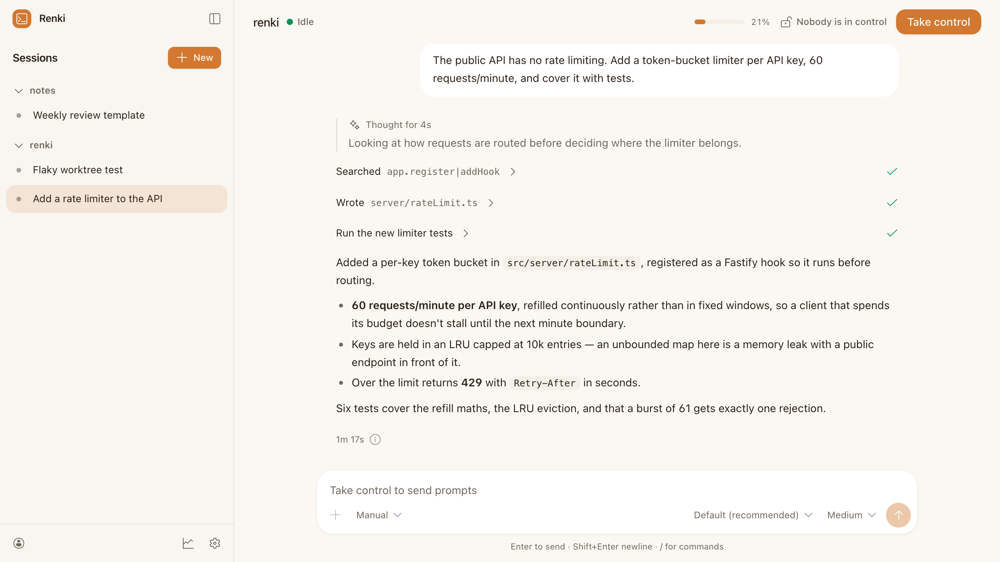
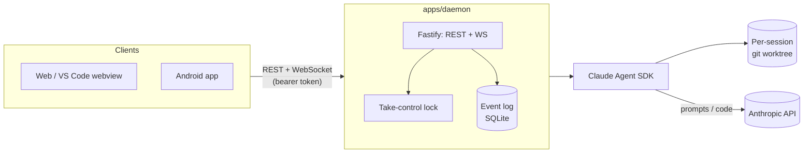

# Renki

[](https://github.com/Zawaer/renki/actions/workflows/ci.yml)
[](./LICENSE)
[](https://nodejs.org)

**Run [Claude Code](https://claude.com/claude-code) on your own server, and
drive it from your phone.**

Renki is a daemon you run on the machine that already holds your repos — a
homelab box, a VPS, whatever is on 24/7. It owns the `claude` processes; web,
VS Code and Android clients attach to it over your tailnet. Close your laptop
and the work carries on; open your phone on the bus and you're in the same
session, mid-turn, with every tool call and approval request live.

> *renki* is Finnish for a hired farmhand — someone who works your land while
> you're elsewhere. That's the whole idea.

Nothing runs in anyone else's cloud. Prompts and code reach Anthropic only
through the `claude` process on your own machine; there is no relay server,
and no account but yours is involved.

<picture>
  <source media="(prefers-color-scheme: dark)" srcset="docs/screenshots/session-dark.png">
  
</picture>

## Why

Built to fix three specific frustrations with existing tools:

1. **Staleness** — no more "exit and rejoin to see updates". Every session is an
   append-only, sequence-numbered **event log**; clients fold it and reconnect
   by asking for "everything after seq N", so a reconnecting or late-joining
   device *cannot* miss anything. Staleness is impossible by construction, not
   patched over.
2. **Painless parallelism per repo** — each session runs in its own **git
   worktree** on a dedicated branch, so parallel sessions on the same repo never
   collide on file state.
3. **First-class multi-device control** — every connected device sees the live
   stream (tokens, tool calls, permission prompts); exactly one holds the lock
   and can prompt or approve. Taking control is instant.

Under the hood the daemon drives Claude via the official
`@anthropic-ai/claude-agent-sdk` (structured streaming + programmatic permission
callbacks) rather than scraping the interactive CLI — which is what makes the
whole thing robust.

**Optional multi-account rotation:** if you have more than one Claude account,
the daemon can automate the manual "swap accounts when I hit my limit" habit —
it drives [`cswap`](https://github.com/realiti4/claude-swap) to change which
account the official CLI loads at its next startup (never mid-turn, fail-safe,
never touching tokens itself). See [SETUP.md](./SETUP.md).

## Features

- **Sessions that outlive your laptop** — the daemon owns one long-lived
  `claude` process per session, so background agents keep working (and keep
  asking for approvals) after the turn that spawned them ends.
- **Steer a turn while it runs** — a prompt sent mid-turn is delivered into the
  running turn at its next tool boundary, not queued behind it. Change your
  mind halfway through a refactor without stopping it.
- **Live, replayable sessions** — an event-sourced log means a reconnect or a
  fresh device catches up perfectly; nothing is ever missed or duplicated.
  "Exit and rejoin to see updates" is impossible by construction.
- **Take-control locking** — one device drives, every other connected device
  watches the same stream live; handing off control is instant.
- **Per-session git worktrees** — parallel sessions on the same repo never step
  on each other's file state, each on its own branch, merged back with
  `renki merge` (which spawns a resolution session only when git actually
  conflicts).
- **Remote approvals** — a gated tool call pages whichever device holds
  control, on the phone included, and auto-denies rather than hanging forever.
- **Three clients from one core** — web, VS Code (embeds the web bundle in a
  webview), and a native Android app all share the same reducer and
  reconnecting WebSocket client (`packages/client-core`).
- **QR device pairing** — an already-connected client shows a QR of its own
  working connection; scan it instead of typing a tailnet URL and a
  43-character token by hand.
- **Push notifications** (Android) for permission requests and turn completion
  while the app is backgrounded.
- **Usage you can actually read** — every window claude.ai reports (the 5-hour
  session, the weekly all-model cap, and the separate weekly cap on a premium
  model), with reset times, on every client.
- **Optional multi-account rotation** — proactively, or on a real rate-limit
  failure, switches which Claude account the CLI uses next via
  [`cswap`](https://github.com/realiti4/claude-swap) — with a preferred account
  it returns to as soon as that one has headroom again.
- **A trash, not a cliff** — deleting a session keeps its transcript
  recoverable for 30 days.
- **Preview what a session builds** — a dev server started inside a session is
  reachable from your phone at a URL, with no port publishing or tunnels.
- **Stats** — cost, tokens, wait time and streaks, lifetime / daily / monthly /
  per-repo, on web and phone.
- **Optional [RTK](https://github.com/rtk-ai/rtk) support** — rewrites Bash
  commands through RTK's compacting proxy to cut token usage on common dev
  operations, with its savings surfaced live in every client.
- **Tailscale-first security model** — no ports on the public internet, a
  constant-time bearer token on top, session isolation by construction.

## Architecture

Monorepo (pnpm + Turbo):

| Package | What it is |
| --- | --- |
| `packages/protocol` | The shared contract: Zod schemas for domain types, the event log, and every WS/REST message. |
| `packages/client-core` | Pure-TS brain reused by every client: the event-log→state reducer, a reconnecting WebSocket client (replays from `lastSeq`), the REST client, and the QR pairing codec. No DOM. |
| `apps/daemon` | The always-on host service (homelab box or VPS): runs Claude sessions (SDK, one long-lived process per session so background agents outlive their turn), git worktrees, SQLite persistence, and one HTTP port serving REST + WebSocket. |
| `apps/web` | Reference client (React + Vite + Tailwind). Reused as-is inside the VS Code webview. |

`apps/vscode` embeds that same web bundle in a webview panel — the only
VS Code-specific code is config plumbing (daemon URL in settings, token in
SecretStorage) and a `postMessage` bridge (click a file in a tool call to open
it in your editor). `apps/mobile` is an Expo / React Native app that reuses
`client-core` + `protocol` (the views are RN-native, since DOM components can't
cross over) and adds push notifications and native QR scan/show for pairing.



## Quick start

See **[SETUP.md](./SETUP.md)** for the full always-on-host + Tailscale
walkthrough (daemon, web, VS Code, Android, QR pairing, multi-account
rotation).

```bash
pnpm install && pnpm build
cp .env.example .env
pnpm --filter @renki/daemon cli token   # -> paste into .env as RENKI_AUTH_TOKEN
pnpm --filter @renki/daemon dev          # start the daemon
pnpm --filter @renki/web dev             # open http://127.0.0.1:5173
```

Run the test suite (Vitest) with `pnpm test` — it covers the pure core: the
event-log→state reducer (determinism + replay==live), the daemon's event log
(seq monotonicity, gap-free replay), the rate-limit classifier, the
SessionManager lock/single-writer invariants, the account-rotation policy
engine and the permission broker's fail-safe timeout, the diff/todo/plan
tool-input parsers shared by every client, and the legacy-session-id and
merge-conflict-flow migrations — plus component tests for the web app.

## Status

Single-user and self-hosted, running daily on the author's homelab. The
protocol, daemon, web/VS Code/Android clients, pairing, rotation and the test
suite are all in place; [NEXT_STEPS.md](./NEXT_STEPS.md) is the running
punch-list of what's next.

Worth knowing before you deploy it:

- **It authenticates one user, not many.** A single bearer token guards the
  daemon; there are no accounts or per-user permissions. It's designed to sit
  on a tailnet, not on the public internet — see [SECURITY.md](./SECURITY.md).
- **Sessions run with your `claude` credentials** on your own machine, with
  whatever filesystem access that machine gives them.
- **Android only** on mobile. The web app works fine in mobile Safari; there
  is no iOS build.

## Contributing

Contributions are welcome — see [CONTRIBUTING.md](./CONTRIBUTING.md) for dev
setup, testing expectations, and where things live. Please also read the
[Code of Conduct](./CODE_OF_CONDUCT.md).

## Security

Found a vulnerability? Please don't open a public issue — see
[SECURITY.md](./SECURITY.md) for how to report it privately.

## License

[MIT](./LICENSE)
