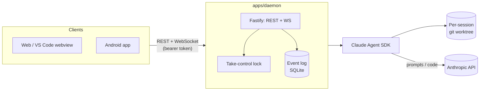

# Claude Remote Control (CRC)

[](https://github.com/Zawaer/claude-remote-control/actions/workflows/ci.yml)
[](./LICENSE)
[](https://nodejs.org)

Self-hosted, multi-device remote control for [Claude Code](https://claude.com/claude-code).
Run and watch multiple parallel Claude Code sessions across your repos from any
device — your Mac, VS Code, or your phone — with real-time sync and a
**take-control** lock so one device drives while the others watch live.

It runs entirely on your own hardware — a homelab box or a personal VPS,
whichever you already have running 24/7. Prompts and code only ever reach
Anthropic through the `claude` process the daemon runs locally; there is no
relay server.

## Why

Built to fix three specific frustrations with existing tools:

1. **Staleness** — no more "exit and rejoin to see updates". Every session is an
   append-only, sequence-numbered **event log**; clients fold it and reconnect
   by asking for "everything after seq N", so a reconnecting or late-joining
   device *cannot* miss anything. Staleness is impossible by construction, not
   patched over.
2. **Painless parallelism per repo** — each session runs in its own **git
   worktree** on a dedicated branch, so parallel sessions on the same repo never
   collide on file state.
3. **First-class multi-device control** — every connected device sees the live
   stream (tokens, tool calls, permission prompts); exactly one holds the lock
   and can prompt or approve. Taking control is instant.

Under the hood the daemon drives Claude via the official
`@anthropic-ai/claude-agent-sdk` (structured streaming + programmatic permission
callbacks) rather than scraping the interactive CLI — which is what makes the
whole thing robust.

**Optional multi-account rotation:** if you have more than one Claude account,
the daemon can automate the manual "swap accounts when I hit my limit" habit —
it drives [`cswap`](https://github.com/realiti4/claude-swap) to change which
account the official CLI loads at its next startup (never mid-turn, fail-safe,
never touching tokens itself). See [SETUP.md](./SETUP.md).

## Features

- **Live, replayable sessions** — an event-sourced log means a reconnect or a
  fresh device catches up perfectly; nothing is ever missed or duplicated.
- **Take-control locking** — one device drives, every other connected device
  watches the same session stream live; handing off control is instant.
- **Per-session git worktrees** — parallel sessions on the same repo never
  step on each other's file state.
- **Four clients from one core** — web, VS Code (embeds the web bundle in a
  webview), and a native Android app all share the same reducer and
  reconnecting WebSocket client (`packages/client-core`).
- **QR device pairing** — an already-connected client shows a QR of its own
  working connection; scan it from a new device instead of typing a tailnet
  URL and a 43-character token by hand.
- **Push notifications** (Android) for permission requests and turn completion
  while the app is backgrounded.
- **A Settings screen and a Stats screen on every client** — device/connection
  info, cswap account management (switch/add/rotation threshold), and
  cost/token/wait-time analytics (lifetime, daily, monthly, by-repo), at full
  parity between web and the Android app.
- **Optional multi-account rotation** — proactively (or on a real rate-limit
  failure) switches which Claude account the CLI uses next, via `cswap`.
- **Optional [RTK](https://github.com/rtk-ai/rtk) support** — rewrites Bash
  commands through RTK's compacting proxy to cut token usage 60-90% on common
  dev operations (`git`, test runners, linters, etc), with its savings stats
  surfaced live in every client. See
  [SETUP.md](./SETUP.md#rtk-token-savings-support-optional).
- **Tailscale-first security model** — no ports on the public internet, a
  constant-time bearer token on top, session isolation by construction.

## Architecture

Monorepo (pnpm + Turbo):

| Package | What it is |
| --- | --- |
| `packages/protocol` | The shared contract: Zod schemas for domain types, the event log, and every WS/REST message. |
| `packages/client-core` | Pure-TS brain reused by every client: the event-log→state reducer, a reconnecting WebSocket client (replays from `lastSeq`), the REST client, and the QR pairing codec. No DOM. |
| `apps/daemon` | The always-on host service (homelab box or VPS): spawns Claude sessions (SDK, resume-per-prompt), git worktrees, SQLite persistence, and one HTTP port serving REST + WebSocket. |
| `apps/web` | Reference client (React + Vite + Tailwind). Reused as-is inside the VS Code webview. |

`apps/vscode` embeds that same web bundle in a webview panel — the only
VS Code-specific code is config plumbing (daemon URL in settings, token in
SecretStorage) and a `postMessage` bridge (click a file in a tool call to open
it in your editor). `apps/mobile` is an Expo / React Native app that reuses
`client-core` + `protocol` (the views are RN-native, since DOM components can't
cross over) and adds push notifications and native QR scan/show for pairing.



## Quick start

See **[SETUP.md](./SETUP.md)** for the full always-on-host + Tailscale
walkthrough (daemon, web, VS Code, Android, QR pairing, multi-account
rotation).

```bash
pnpm install && pnpm build
cp .env.example .env
pnpm --filter @crc/daemon cli token   # -> paste into .env as CRC_AUTH_TOKEN
pnpm --filter @crc/daemon dev          # start the daemon
pnpm --filter @crc/web dev             # open http://127.0.0.1:5173
```

Run the test suite (Vitest) with `pnpm test` — it covers the pure core: the
event-log→state reducer (determinism + replay==live), the daemon's event log
(seq monotonicity, gap-free replay), the rate-limit classifier, the
SessionManager lock/single-writer invariants, the account-rotation policy
engine and the permission broker's fail-safe timeout, the diff/todo/plan
tool-input parsers shared by every client, and the legacy-session-id and
merge-conflict-flow migrations — plus component tests for the web app.

## Status

- [x] Protocol contract + daemon core (worktrees, SDK, persistence)
- [x] WebSocket + REST server with event-sourced replay & take-control lock
- [x] Shared `client-core` + React web app
- [x] Security: Tailscale-friendly, token auth, safe-bind guard
- [x] VS Code extension (webview reusing the web bundle + editor bridge)
- [x] Android app (Expo) + push notifications
- [x] QR device pairing (scan instead of typing a URL + token)
- [x] Optional multi-account usage rotation (cswap) + usage % with org picker
- [x] Vitest unit suite over the pure core (reducer, event log, lock invariants)
- [x] CI (build + typecheck + test on every push/PR)

All six build steps complete. Single-user, self-hosted, v1. Built as a
portfolio project — see [NEXT_STEPS.md](./NEXT_STEPS.md) for what's next,
including the open-source/onboarding roadmap.

## Contributing

Contributions are welcome — see [CONTRIBUTING.md](./CONTRIBUTING.md) for dev
setup, testing expectations, and where things live. Please also read the
[Code of Conduct](./CODE_OF_CONDUCT.md).

## Security

Found a vulnerability? Please don't open a public issue — see
[SECURITY.md](./SECURITY.md) for how to report it privately.

## License

[MIT](./LICENSE)
